# Hybrid Identity and Security Homelab

An enterprise-style homelab that demonstrates how on-premises Active Directory, Microsoft Entra ID, private application access, Windows and Linux administration, centralized monitoring, and infrastructure as code fit together.

Core services run on a private Proxmox network. Selected identities synchronize to Microsoft Entra ID, approved users reach an internal application through Entra Application Proxy, and Windows and Linux events are collected and tested with Wazuh.

## Project at a glance

| Area | Technology / system | Demonstrated result |
| --- | --- | --- |
| Virtualization | Proxmox | Hosts the private lab environment and its service VMs |
| Core identity | `DC01` / `WIN-DC01` | Active Directory Domain Services, DNS, OUs, users, and groups for `corp.local` |
| Administration | `ADMIN01` | RSAT-based Active Directory administration workstation |
| Hybrid identity | `SYNC01` | Microsoft Entra Connect Sync with scoped lab identities |
| File services | `FS01` | SMB file-server role with AD-backed access controls |
| Internal application | `WEB01` | Nginx web application on Ubuntu |
| Private remote access | Entra Application Proxy + Conditional Access | Published WEB01 access with MFA for approved users |
| Monitoring | `WAZUH01` | Five active agents and tested custom Windows/Linux detections |
| Cloud IaC | Azure Terraform | Standalone Azure web VM with HTTPS and Key Vault-backed admin authentication |
| Security validation | `KALI01` | Planned isolated lab-only validation phase |

## Architecture

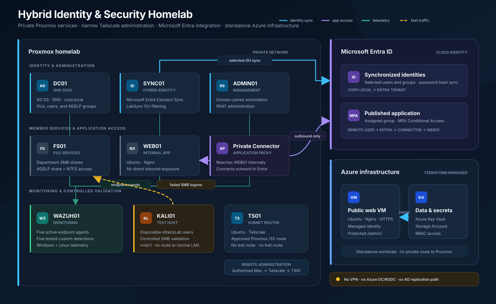

### Important design boundary

This lab does not use a Site-to-Site VPN. Microsoft Entra Connect Sync synchronizes selected identities; it does not create a private network path or route traffic to the lab.

`WEB01` remains private. Approved remote users authenticate to Microsoft Entra ID, and Entra Application Proxy uses its internal connector to reach the application. There is no direct inbound internet exposure of `WEB01`, Active Directory, SMB, RDP, Proxmox, Wazuh, or other management services.

The Azure Terraform workload is deliberately standalone. It demonstrates secure, repeatable cloud deployment without implying a private Azure-to-home-lab network path.

## What I built

### 1. Proxmox foundation

I created a private Proxmox environment for the domain controller, administration workstation, Entra sync server, file server, web server, and Wazuh server. Keeping these services on an internal network supports enterprise-style testing without exposing management interfaces publicly.

The active Windows and Ubuntu workloads are visible in the [Wazuh endpoint inventory](evidence/wazuh/01-agent-overview.png). WEB01 is shown serving the internal application in the web-server evidence below.

**Related material:** [Proxmox Terraform plan](terraform/proxmox/README.md), [network design](docs/network-design.md).

### 2. Active Directory and DNS — `DC01`

I deployed `DC01` as the Active Directory Domain Services and DNS server for the `corp.local` domain. The directory contains departmental OUs, lab users, and security groups that support role-based access and hybrid synchronization.

For permissions, I use an AGDLP-style approach:

```text
Accounts → Global groups → Domain local groups → Permissions
```

This separates who a user is from what a resource allows. Users are placed in role-based global groups; those groups are nested into domain local groups that receive permissions on resources such as file shares.

<details>
<summary>Active Directory and DNS evidence</summary>

The AD Users and Computers view shows the departmental OU structure and the selected `HR` OU with its user and security group.

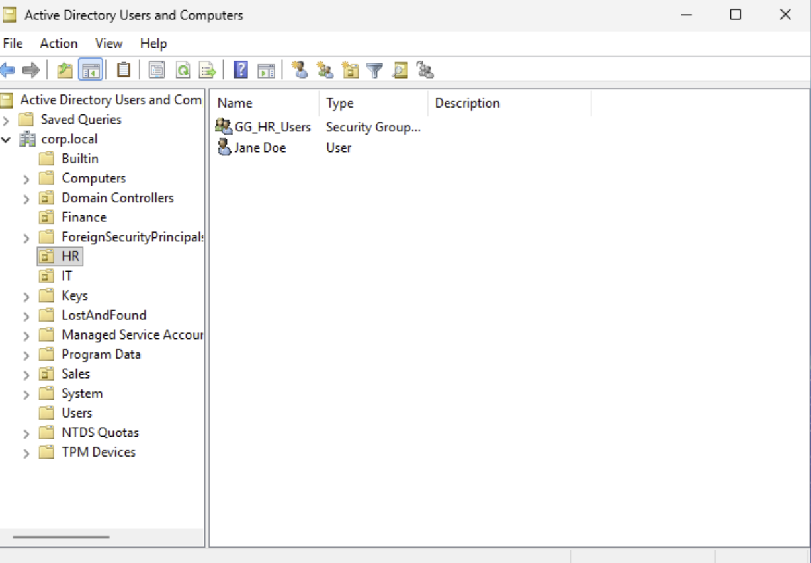

The domain-controller health check shows DNS, Kerberos, NetLogon, and Active Directory Domain Services running.

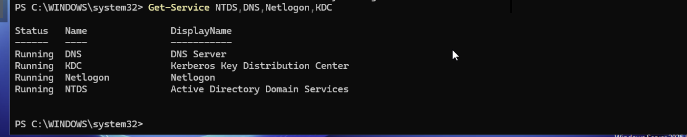

The PowerShell inventory shows the lab's AD user objects, including the synchronized-test account's UPN.

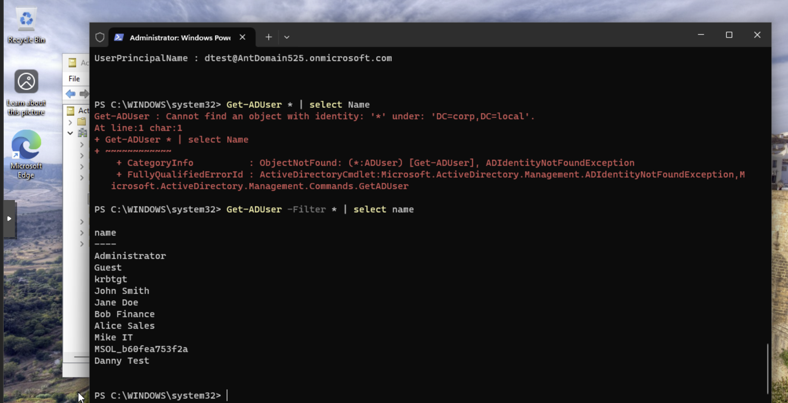

</details>

**Related material:** [AD design](docs/active-directory.md), [AD bootstrap script](scripts/ad-bootstrap.ps1), [AD configuration script](scripts/ad-setup.ps1).

### 3. Administrative workstation — `ADMIN01`

Rather than performing routine management directly on the domain controller, I configured `ADMIN01` as an RSAT workstation. This separates day-to-day directory administration from the server that holds the domain-services role. `ADMIN01` is also enrolled and active in the Wazuh endpoint inventory.

**Related material:** [ADMIN01 setup script](scripts/admin01-setup.ps1), [operations runbook](docs/operations-runbook.md).

### 4. File services and authorization — `FS01`

`FS01` provides departmental SMB shares. Share and NTFS access is assigned through the AD group model rather than directly to individual users, making access easier to audit as roles change. Its Windows security events are also monitored by Wazuh; the failed-logon detection is included in the monitoring evidence below.

**Related material:** [file server setup script](scripts/file-server-setup.ps1), [AD design](docs/active-directory.md).

### 5. Internal web application — `WEB01`

I deployed `WEB01` as an internal Ubuntu application server using Nginx. It provides a realistic application to protect and publish without making the server itself directly reachable from the internet.

<details>
<summary>WEB01 evidence</summary>

The application is available from the private lab network.

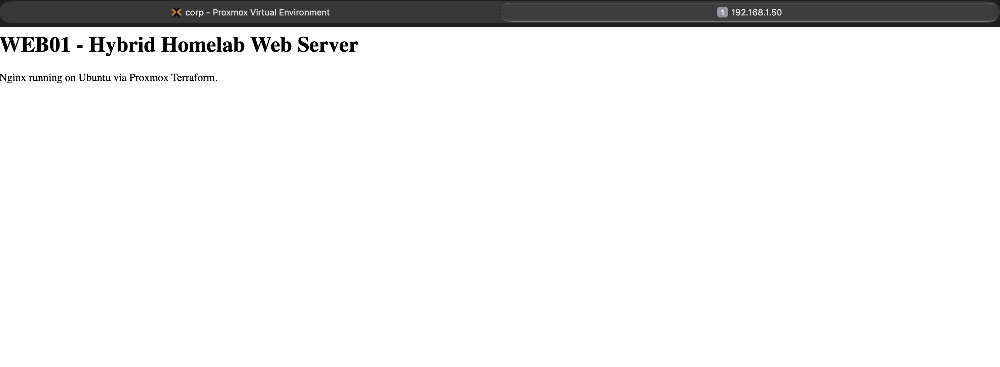

An HTTP request returned `200 OK` and the expected WEB01 page content.

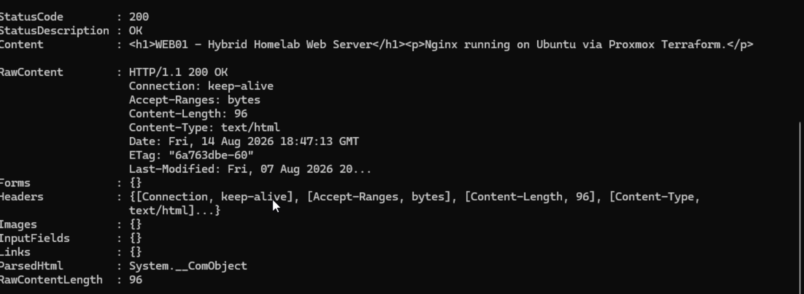

Forward and reverse DNS resolution both identify `web01.corp.local`.

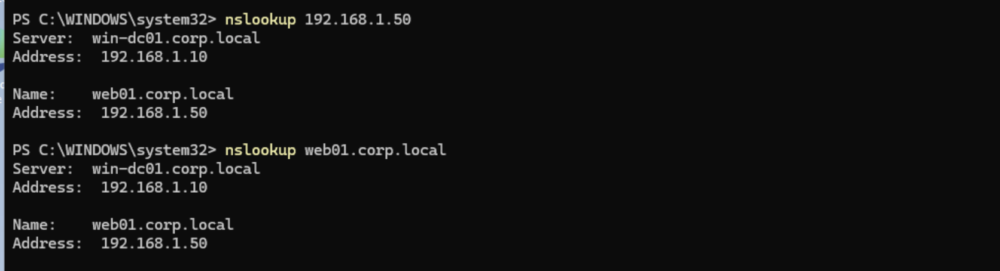

</details>

**Related material:** [application-access design](docs/application-access.md).

### 6. Hybrid identity — `SYNC01` and Microsoft Entra Connect Sync

I configured `SYNC01` as the Microsoft Entra Connect Sync server. Only selected lab identities and OUs synchronize to Microsoft Entra ID, keeping the project scoped and avoiding treating every on-premises object as cloud-ready. I use an alternate UPN suffix for cloud sign-in while keeping the local Active Directory domain independent.

<details>
<summary>Hybrid-identity evidence</summary>

The Microsoft Entra users view shows synchronized lab identities, including the `On-premises sync` status for selected users.

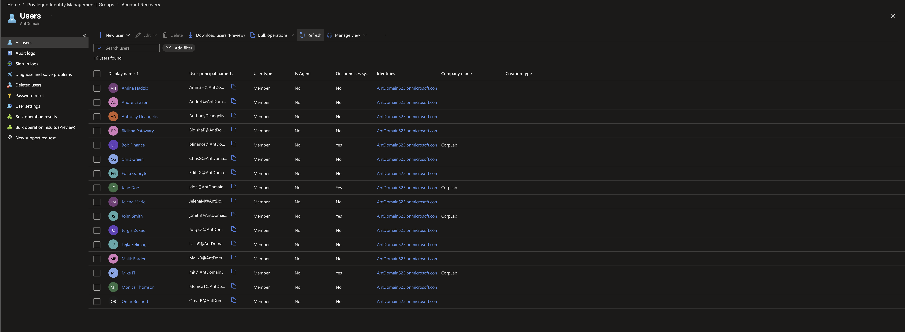

The `GG_Lab_AppProxy_Users` security group is sourced from Windows Server AD and has three direct members. It is the access group used for the published application.

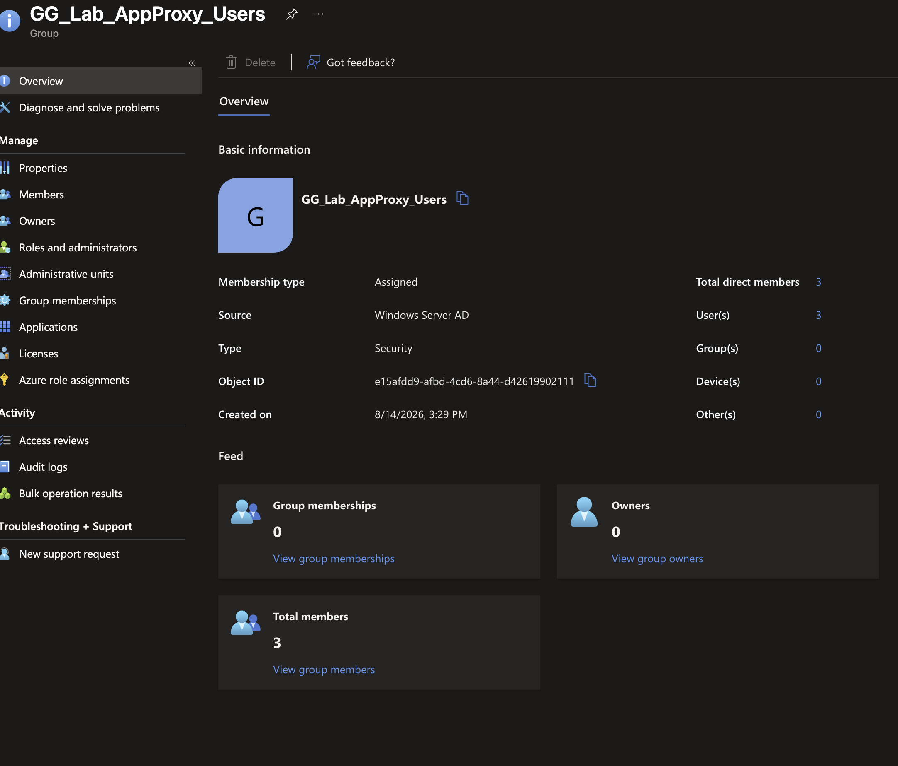

</details>

**Related material:** [Entra Connect runbook](docs/entra-connect-runbook.md), [UPN update script](scripts/set-lab-upn.ps1).

### 7. Private application publishing and Conditional Access

I published the internal `WEB01` application through Microsoft Entra Application Proxy. The connector runs inside the lab, reaches WEB01 internally, and uses outbound connectivity to Entra. This allows approved remote users to reach the private application without opening inbound firewall rules to the server.

The application is assigned to the synchronized access group. Conditional Access is enabled for the published application and requires MFA. The validation flow below records the private connector as active, the MFA step for the lab test account, successful remote application access, and a rejected sign-in attempt.

<details>
<summary>Application Proxy and Conditional Access evidence</summary>

The Entra Private Network connector is active.

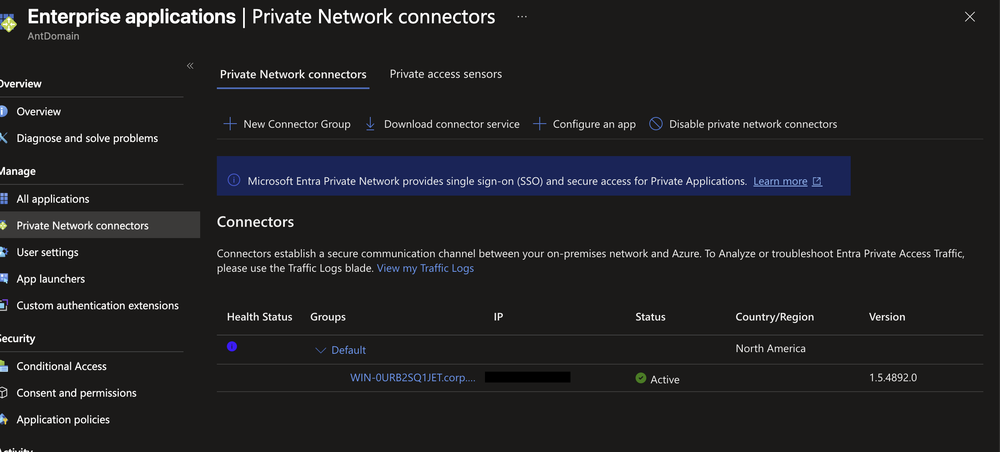

The lab test account was prompted to set up Microsoft Authenticator before completing the sign-in flow.

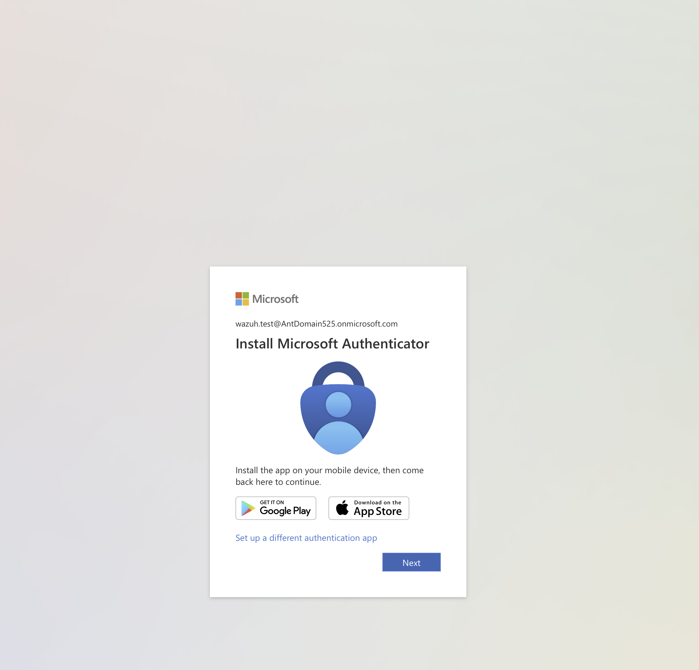

After authentication, the external Application Proxy URL served the WEB01 application successfully.

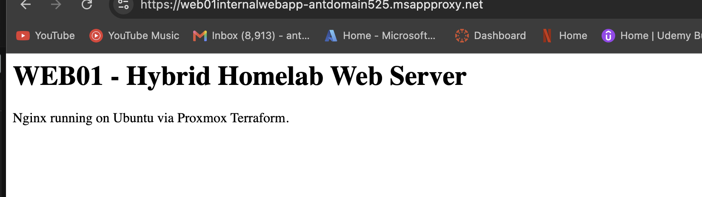

A separate attempted sign-in to the Web01 Internal Web App was rejected before application access.

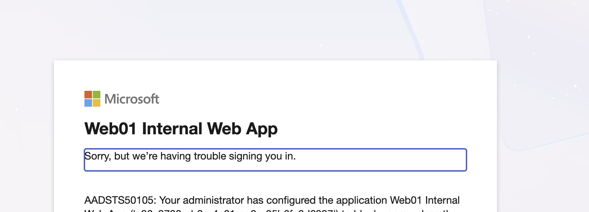

</details>

**Related material:** [application-access design](docs/application-access.md), [network design](docs/network-design.md), [operations runbook](docs/operations-runbook.md).

### 8. Monitoring and custom detections — `WAZUH01`

I deployed `WAZUH01` as the centralized monitoring platform for the lab. Windows and Linux agents report endpoint events to the Wazuh manager and dashboard. I built and tested custom detections rather than relying only on default alerts.

| System | Activity tested | Custom rule |
| --- | --- | --- |
| `DC01` | New Active Directory user account created | `100101` |
| `DC01` | Active Directory group membership changed | `100100` |
| `SYNC01` | Entra Connect service stopped | `100110` |
| `FS01` | Five failed Windows logons within 120 seconds | `100120` |
| `WEB01` | Sudo command used | `100200` |

<details>
<summary>Wazuh endpoint and detection evidence</summary>

Five active agents cover the domain controller, file server, sync server, administration workstation, and WEB01.

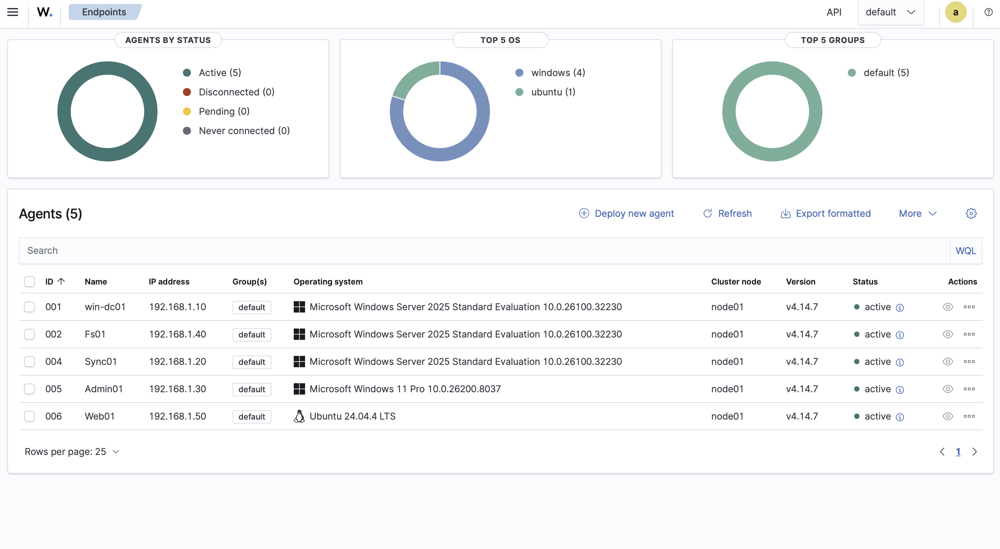

The alert query returns the custom AD group-membership rule `100100` and new-user rule `100101`, using Windows event IDs `4728` and `4720` respectively.

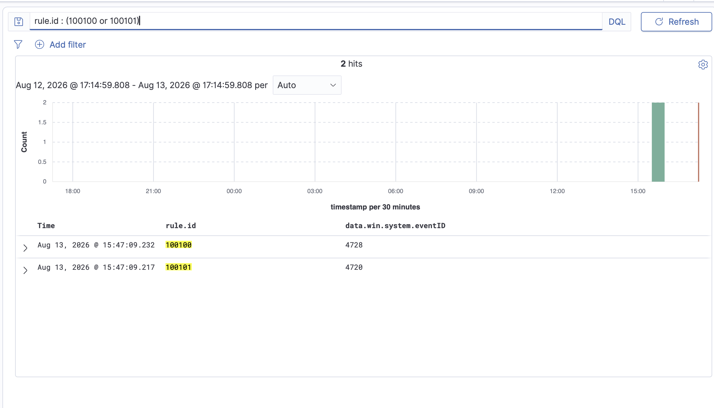

Stopping the Microsoft Entra Connect Sync service during a controlled test produced rule `100110`.

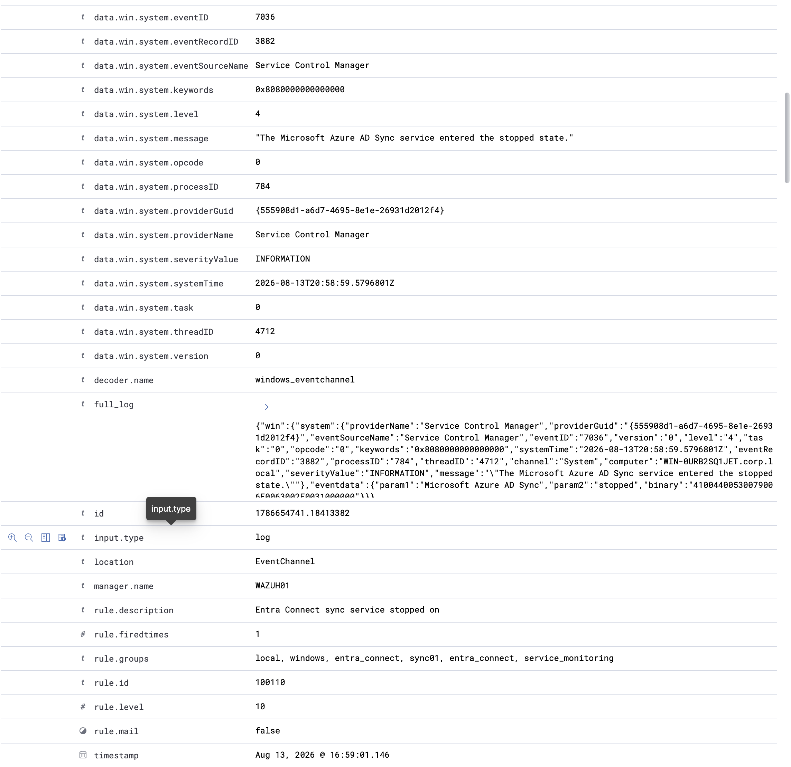

Five failed Windows logons on FS01 produced rule `100120`.

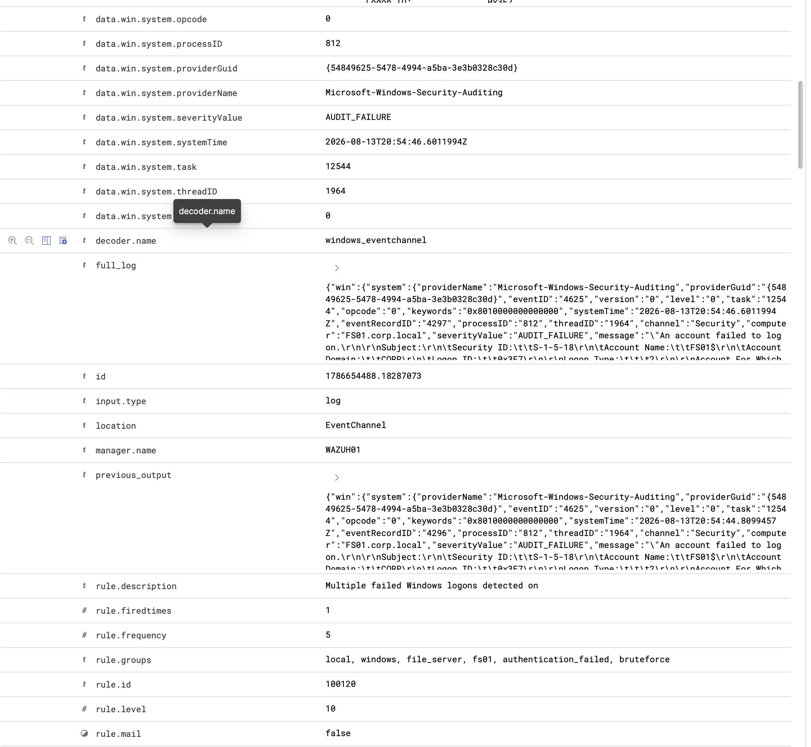

A sudo command on WEB01 produced rule `100200`.

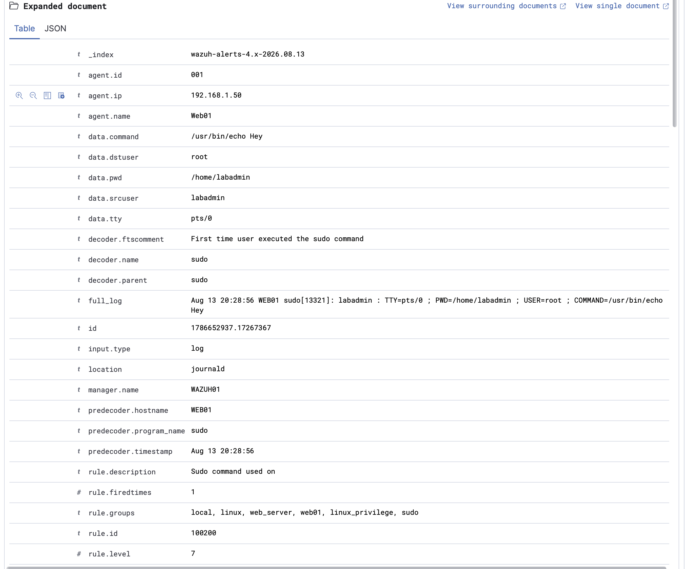

The detailed Entra Connect and sudo alert captures predate a Wazuh-agent re-enrollment performed during the lab build. This is why an older alert can show a different agent ID from the current endpoint overview; the hostname, event details, and rule ID identify the validated system and activity.

</details>

One troubleshooting lesson was especially useful: Wazuh dashboard alerts show fields in JSON such as `data.win.system.eventID`, but custom XML rules use the decoder field name, such as `win.system.eventID`. Correcting that field path and chaining the account-creation rule from built-in rule `60109` allowed the custom AD account-creation rule to fire correctly.

**Related material:** [Wazuh overview](wazuh/README.md), [custom-rule notes](wazuh/custom-rules/README.md), [validated XML rules](wazuh/custom-rules/local_rules.xml).

### 9. Azure infrastructure as code and protected web administration

I deployed a standalone Azure workload with a resource group, VNet, subnet, NSG, public IP, Ubuntu web VM, Storage Account, and Key Vault. It is intentionally separate from the private Proxmox lab: there is no Azure domain controller, RODC, VPN, or route to the home network.

The Azure web VM is available at `https://hybridhomelabweb.eastus2.cloudapp.azure.com`. Nginx uses a Let's Encrypt certificate and redirects HTTP to HTTPS. Its `/admin/` page is protected with Nginx Basic Authentication using a bcrypt hash manually retrieved from Azure Key Vault by the VM's system-assigned managed identity.

```text
Azure Key Vault → Azure VM managed identity → local Nginx password-hash file → /admin/ authentication
```

The Key Vault read was validated with an HTTP `200` response without displaying the secret. An unauthenticated request to `/admin/` returned `401 Unauthorized`; authenticating as the configured admin user loaded the protected page. Nginx validates each request locally. Secret retrieval is currently manual during setup and after password rotation; an automated refresh job is a future improvement, not a claimed feature.

<details>
<summary>Azure infrastructure, HTTPS, and Key Vault evidence</summary>

Terraform completed with ten resources added.


The Azure resource inventory shows the deployed public IP, VNet, NSG, Key Vault, NIC, VM, disk, and Storage Account. The subnet is a child resource, and the resource group itself is the scope of this command, so neither appears in this inventory output.

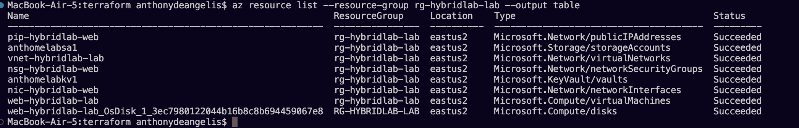

The Key Vault role assignment shows `web-hybridlab-lab` with the least-privilege `Key Vault Secrets User` role on `anthomelabkv1`.

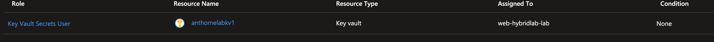

DNS resolves `hybridhomelabweb.eastus2.cloudapp.azure.com` to the deployed public IP.

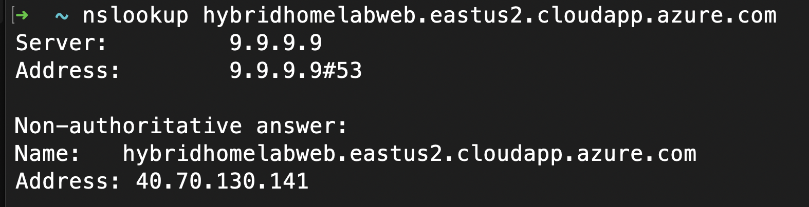

Certbot successfully deployed a certificate for the public hostname and the Nginx site.

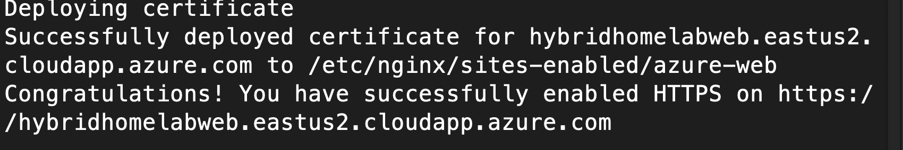

The managed-identity request to Key Vault returned `200`, confirming that the Azure VM can read the configured secret without exposing its value.

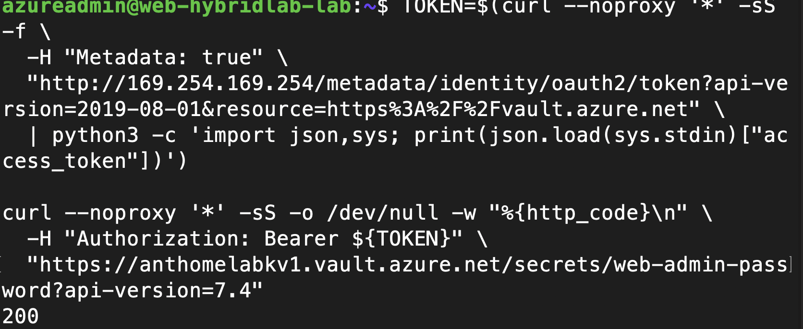

An unauthenticated request to `/admin/` returned `401 Unauthorized` with Nginx's Basic Authentication challenge.

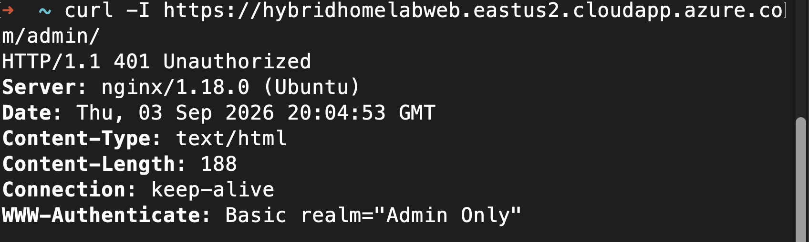

After authentication as the configured admin user, the protected admin page loaded successfully.

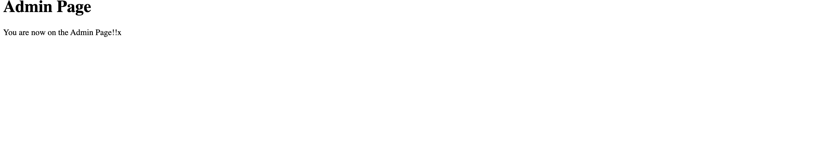

</details>

**Related material:** [Azure Terraform README](terraform/README.md), [Terraform configuration](terraform/), [GitHub Actions Terraform workflow](.github/workflows/terraform.yml).

## Planned project phases

### Controlled security validation — `KALI01`

The next planned lab phase is an isolated `KALI01` validation VM. Its purpose is to generate safe, authorized activity against only the systems I own so that Wazuh, Windows event logging, and access controls can be validated.

Before testing, I will document network isolation, approved targets, disposable test accounts, expected results, cleanup actions, and evidence. No public, school, work, shared-home, or otherwise unauthorized systems are in scope.

**Related material:** [controlled validation scenarios](docs/attack-scenarios.md).

## Evidence and screenshots

The screenshots used above are stored in the matching [`evidence/`](evidence/) folders. They record controlled tests performed with lab-only accounts. The current evidence covers Active Directory, DNS, Entra Connect synchronization, Application Proxy, MFA validation, and the five custom Wazuh rules.

| Folder | Contents |
| --- | --- |
| [`evidence/ad/`](evidence/ad/) | OU, service-health, and AD user inventory evidence |
| [`evidence/entra-connect/`](evidence/entra-connect/) | Synchronized users and App Proxy group evidence |
| [`evidence/app-proxy/`](evidence/app-proxy/) | Connector health and successful/denied application-access tests |
| [`evidence/conditional-access/`](evidence/conditional-access/) | Microsoft Authenticator step from the validation flow |
| [`evidence/web01/`](evidence/web01/) | Internal page, HTTP response, and DNS-resolution evidence |
| [`evidence/wazuh/`](evidence/wazuh/) | Agent overview and custom-rule alerts |
| [`evidence/azure/`](evidence/azure/) | Terraform, DNS, HTTPS, Key Vault, and protected-admin evidence |

## Security decisions and scope

- No Site-to-Site VPN, Azure domain controller, or Azure RODC is part of this design.
- `WEB01` is published through Entra Application Proxy rather than directly exposed.
- Wazuh, Proxmox, Active Directory, SMB, RDP, and management interfaces remain private.
- Secrets are prompted for at runtime or kept in ignored local configuration files; Terraform state and `.tfvars` files are not committed.
- Controlled validation is limited to isolated, lab-owned systems and disposable test accounts.

## Repository guide

| Location | Contents |
| --- | --- |
| [`docs/`](docs/) | Detailed design notes, runbooks, and troubleshooting |
| [`diagrams/`](diagrams/) | Editable architecture diagram |
| [`scripts/`](scripts/) | Parameterized PowerShell and Bash configuration scripts |
| [`terraform/`](terraform/) | Azure workload and Proxmox VM-lifecycle Terraform configurations |
| [`wazuh/`](wazuh/) | Custom detection rules and rule-testing notes |
| [`evidence/`](evidence/) | Screenshots from controlled lab validation |
| [`policies/`](policies/) | Azure Policy notes |
| [`.github/workflows/`](.github/workflows/) | Terraform validation workflow |

## Supporting documentation

- [Architecture decisions](docs/architecture.md)
- [Active Directory design](docs/active-directory.md)
- [Entra Connect runbook](docs/entra-connect-runbook.md)
- [Application-access design](docs/application-access.md)
- [Network design](docs/network-design.md)
- [Operations runbook](docs/operations-runbook.md)
- [Troubleshooting notes](docs/troubleshooting.md)

## Future improvements

- Consider automated Key Vault secret refresh if a future lab phase needs password rotation.
- Build and isolate `KALI01`, then run approved detection-validation exercises.
- Add a second Application Proxy connector for high availability.
- Add backup and restore testing for critical services.
- Continue expanding Wazuh detections and dashboard views.
