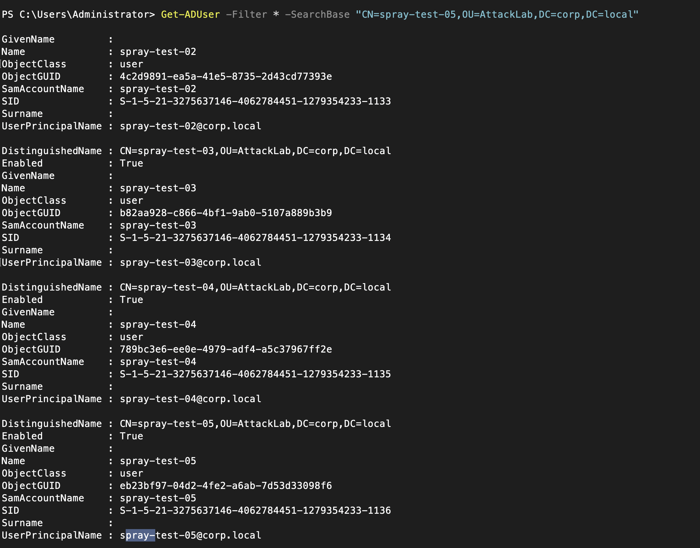
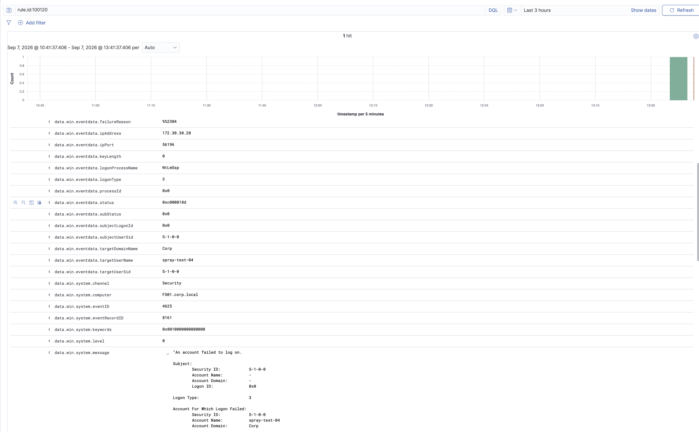

# KALI01 Controlled Validation Runbook

## Purpose and scope

`KALI01` is a lab-owned attacker-simulation VM. This completed validation exercised the `FS01` SMB authentication path and verified that Wazuh correlates repeated failed Windows logons. It is limited to the private homelab, `FS01`, and disposable accounts in the `AttackLab` OU.

Do not use these steps against public, work, school, shared-home, or otherwise unauthorized systems.

## Network isolation

Proxmox uses an internal-only Linux bridge, `vmbr1`, with no physical bridge port and no gateway. It forms the isolated `172.30.30.0/24` test segment.

| VM | Adapter arrangement | Test-segment address | Purpose |
| --- | --- | --- | --- |
| `KALI01` | One adapter on `vmbr1` | `172.30.30.20/24` | Attacker-simulation host; no default gateway or DNS on this segment |
| `FS01` | Normal service adapter plus a second adapter on `vmbr1` | `172.30.30.10/24` | Approved SMB target while retaining normal AD and Wazuh connectivity |

On `FS01`, Windows Defender Firewall allows inbound TCP 445 only from `172.30.30.20`. No route or gateway joins `vmbr1` to the normal lab network. Kali is administered through the Proxmox console after its normal-network adapter is removed.

## Disposable test identities

From `ADMIN01`, signed in as a domain administrator, I ran [kali-attacklab-accounts.ps1](../scripts/kali-attacklab-accounts.ps1). The one-time script creates the unprivileged `AttackLab` OU and five test identities:

```text
spray-test-01
spray-test-02
spray-test-03
spray-test-04
spray-test-05
```

The accounts are deliberately not members of departmental, administrative, file-access, or Entra-sync groups.

## Validation procedure

1. Confirm Kali can reach only the approved test endpoint: `nc -vz 172.30.30.10 445`.
2. Create `test-users.txt` on Kali with the five disposable account names.
3. Run one intentionally incorrect SMB password attempt per listed account:

   ```bash
   nxc smb 172.30.30.10 -d CORP -u test-users.txt -p '<intentionally-wrong-password>'
   ```

4. In Wazuh, filter for `rule.id:100120 AND agent.name:FS01`.
5. Confirm the correlated alert contains the underlying Windows Security Event ID `4625`, the disposable username, and source address `172.30.30.20`.

## Result

The test generated failed network logons on `FS01` (Windows Event ID `4625`). The `FS01` Wazuh agent forwarded those events, and custom rule `100120` correlated the repeated failures into a level-10 alert. The event details identify `spray-test-04` and source address `172.30.30.20`, tying the detected activity to Kali.

The rule intentionally evaluates every matching event after its threshold is met during the 120-second window, so multiple `100120` alerts may appear for one test burst. This is expected with the current rule configuration.

## Evidence





## Cleanup

After evidence capture, disable or remove the `spray-test-*` accounts. Keep `KALI01` attached only to `vmbr1`, and retain no broader route to the normal home or lab network.
